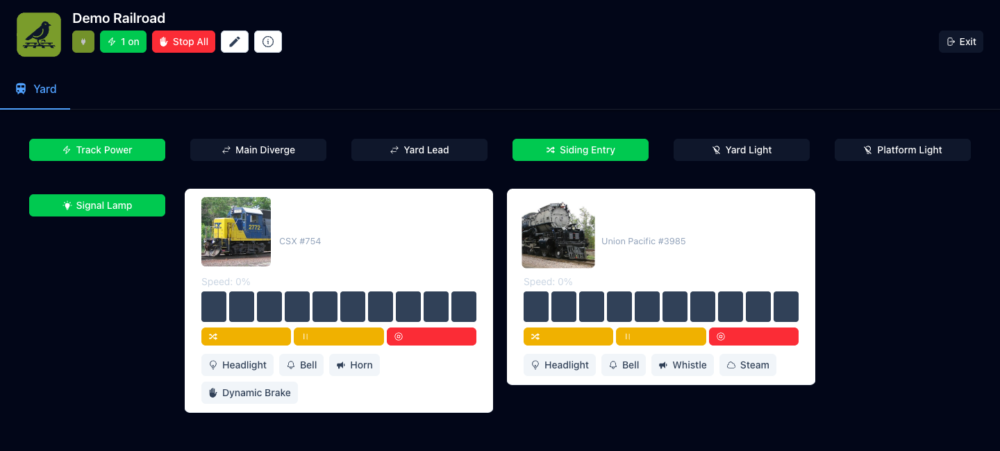
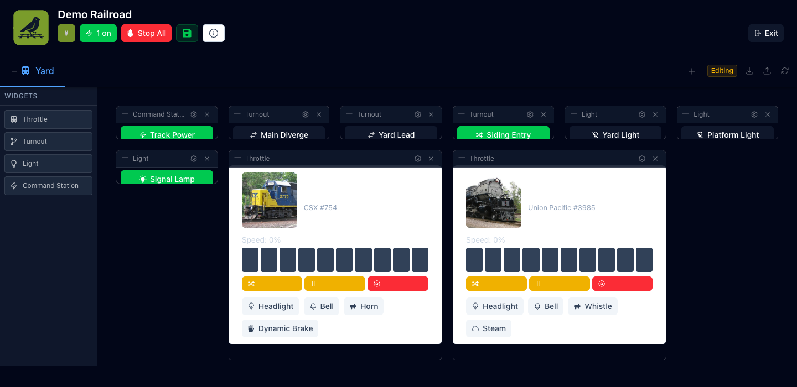

<div align="center">
  
  <h1>YardBird</h1>
  <p>A drag-and-drop layout control panel for model railroads.</p>

  [](https://github.com/yamanote1138/yardbird/actions/workflows/ci.yml)
  [](https://hub.docker.com/r/yamanote1138/yardbird)
  
  
  
  
</div>

---

YardBird is a pure frontend SPA that connects directly to your layout hardware — no backend server, no database. Build your control panel visually: create tabs, drag widgets onto a grid, and configure each one. Your layout is saved locally and can be exported as a YAML file.

<p align="center">
  
  
</p>

## Features

- **Visual dashboard editor** — drag widgets onto a grid, resize, reorder tabs, import/export config
- **Locomotive throttles** — speed, direction, and function buttons from your JMRI roster
- **Turnouts** — toggle switch positions via JMRI / LCC
- **Lights** — toggle LCC lights, independent of track power
- **DC tram control** — JMRI-native tram loop control via a DCC-EX sub-connection, with configurable PWM frequency
- **Command station power** — per-connection power buttons with combined on/off in the header
- **Home Assistant** — control HA lights and switches from your dashboard
- **Responsive** — works on desktop, tablet, and mobile

## Quick start

### Docker

```bash
mkdir -p config
cp yardbird.example.yaml config/yardbird.yaml
$EDITOR config/yardbird.yaml   # set your JMRI host
docker compose up -d
```

Open `http://localhost:9273`.

### Development

```bash
npm install
npm run dev    # http://localhost:5173
```

See [docs/installation.md](docs/installation.md) for full setup details, including JMRI prerequisites and DCC-EX tram control.

## Configuration

Connection settings are managed through the UI and saved in localStorage. `yardbird.yaml` provides factory defaults — it is only read when no saved config exists (first run or after a reset).

See [docs/configuration.md](docs/configuration.md) for the full YAML schema, widget reference, and export/import format.

## Architecture

See [docs/architecture.md](docs/architecture.md) for the plugin system, config flow, Gridstack canvas details, and how to add new widget types.

## Tech Stack

| | |
|---|---|
| [Vue 3](https://vuejs.org/) + TypeScript | Composition API throughout |
| [Vite](https://vitejs.dev/) | Dev server and build tool |
| [Nuxt UI 4](https://ui.nuxt.com/) + [Tailwind CSS 4](https://tailwindcss.com/) | UI components and styling |
| [Gridstack](https://gridstackjs.com/) | Drag-and-drop grid canvas |
| [jmri-client](https://www.npmjs.com/package/jmri-client) | JMRI WebSocket communication |
| [js-yaml](https://github.com/nodeca/js-yaml) | Config file parsing and export |

## License

Private use only
