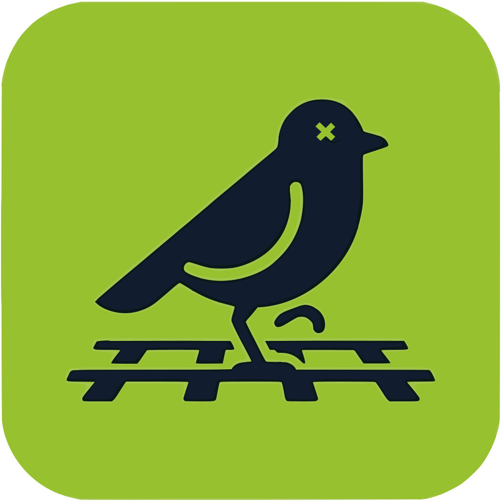

<div align="center">
  
  <h1>YardBird</h1>
  <p>A customizable, plugin-driven layout control panel for model railroads.</p>
</div>

---

YardBird is a pure frontend SPA that connects directly to your layout hardware via WebSocket — no backend server required. Tabs, plugins, and connections are defined in a single YAML file you own and edit.

## Features

- **Locomotive throttles** — speed, direction, and function buttons from your JMRI roster
- **Turnouts** — toggle switch positions (JMRI / LCC)
- **Lights** — toggle LCC lights, independent of track power
- **DC tram control** — direct DCC-EX connection for DC loop trams, with PWM frequency selector
- **Home Assistant** — trigger HA scenes from a layout tab
- **Config-driven tabs** — add, remove, rename, and reorder tabs in `yardbird.yaml`
- **Responsive** — works on desktop, tablet, and mobile

## Tech Stack

| | |
|---|---|
| [Vue 3](https://vuejs.org/) + TypeScript | Composition API throughout |
| [Vite](https://vitejs.dev/) | Dev server and build tool |
| [Nuxt UI 4](https://ui.nuxt.com/) + [Tailwind CSS 4](https://tailwindcss.com/) | UI components and styling |
| [jmri-client 4.1](https://www.npmjs.com/package/jmri-client) | JMRI WebSocket communication |
| [js-yaml](https://github.com/nodeca/js-yaml) | Config file parsing |

## Architecture

YardBird is a pure frontend SPA. The browser connects directly to JMRI and (optionally) DCC-EX via WebSocket — no intermediate server. The DCC-EX proxy is the only server-side component, and it's optional.

```
┌───────────────────────────────┐
│        Browser (Vue 3)        │
│                               │
│  core/useLayout  ←  yardbird.yaml
│  core/useRegistry             │
│                               │
│  plugins/jmri ─────────────── │──→ ws://jmri:12080
│  plugins/dccex ───────────────│──→ ws://proxy:2561
│  plugins/homeassistant ───────│──→ ws://ha:8123
└───────────────────────────────┘
                                        │
                    ┌───────────────────┘
                    ▼
         ┌─────────────────────┐
         │  DCC-EX WS Proxy    │
         │  :2561              │
         │  ┌─ WiThrottle TCP ─│──→ DCC-EX :2560
         │  └─ Native TCP ─────│──→ DCC-EX :2560
         └─────────────────────┘
```

### Plugin system

Each integration lives in its own directory under `src/plugins/`. A plugin exposes a composable (`index.ts`) and one or more widget components.

```
src/
├── core/
│   ├── types.ts          — Plugin, Entity, LayoutConfig type definitions
│   ├── useRegistry.ts    — Singleton registry: aggregates entities across plugins
│   └── useLayout.ts      — Loads and parses yardbird.yaml; exposes tabs + plugin configs
│
├── plugins/
│   ├── jmri/
│   │   ├── index.ts                — useJmri composable (singleton)
│   │   ├── ExtendedJmriClient.ts   — JMRI client subclass (named power sources)
│   │   └── components/
│   │       ├── ThrottleList.vue
│   │       ├── ThrottleCard.vue
│   │       ├── TurnoutList.vue
│   │       ├── LightList.vue
│   │       ├── RosterCard.vue
│   │       └── LocomotiveHeader.vue
│   ├── dccex/
│   │   ├── index.ts                — useDccEx composable (singleton)
│   │   └── components/
│   │       └── TramWidget.vue
│   └── homeassistant/
│       ├── index.ts                — useHomeAssistant composable (singleton)
│       └── components/
│           └── SceneWidget.vue
│
├── components/           — Shared UI (not plugin-specific)
│   ├── ConnectionSetup.vue
│   └── PowerControl.vue
│
├── utils/
│   └── logger.ts
└── types/
    ├── jmri.ts
    └── homeAssistant.ts

public/
└── yardbird.yaml         — Layout and connection configuration (edit this)

proxy/
└── dccex-ws-proxy.mjs    — WebSocket-to-TCP relay for DCC-EX
```

### Naming conventions

- Plugin composables are in `plugins/<name>/index.ts`, exported as `use<Name>` (e.g. `useJmri`)
- Widget components are `<Noun>Widget.vue` for plugin-specific views, `<Noun>List.vue` / `<Noun>Card.vue` for list/item patterns
- Shared components (used by more than one plugin) live in `src/components/`
- Tab IDs in `yardbird.yaml` must match keys in the `tabComponents` map in `App.vue`

---

## Configuration

All layout and connection settings live in a single file: **`yardbird.yaml`**.

The app fetches this file from `/yardbird.yaml` at startup and parses it in the browser. If the file is missing it falls back to safe defaults (JMRI only, three tabs).

### Full schema

```yaml
# YardBird configuration

debug: false  # Enable verbose logging in the browser console

plugins:
  jmri:
    host: raspi-jmri.local   # JMRI server hostname or IP
    port: 12080              # JMRI WebSocket port (default: 12080)
    secure: false            # true = wss:// / https://
    mock: false              # true = simulated data, no hardware needed

  dccex:                     # Optional — remove or comment out to disable
    enabled: true
    host: 192.168.1.231      # DCC-EX CommandStation IP
    port: 2560               # DCC-EX port (default: 2560; proxy listens on 2561)
    pwmFreq: 3               # DC PWM frequency: 0=131Hz 1=490Hz 2=3.4kHz 3=Supersonic

  homeassistant:             # Optional — remove or comment out to disable
    enabled: true
    url: http://homeassistant.local:8123
    token: ''                # Long-Lived Access Token from HA Profile page
    area: train_room         # HA area_id to filter entities

tabs:
  - id: throttles            # Must match a key in App.vue tabComponents
    name: Locomotives        # Displayed in the tab bar
    icon: i-mdi-train        # Any Iconify icon name

  - id: turnouts
    name: Turnouts
    icon: i-mdi-source-branch

  - id: lights
    name: Lights
    icon: i-mdi-lightbulb-outline

  - id: trams                # Only meaningful when dccex plugin is enabled
    name: Trams
    icon: i-mdi-tram

  - id: room                 # Only meaningful when homeassistant plugin is enabled
    name: Room
    icon: i-mdi-home
```

Tabs are rendered in the order they appear. Remove a tab entry to hide it entirely. Rename `name` freely — the `id` is what binds the tab to its component.

### In development

Edit `public/yardbird.yaml` directly. Vite serves the `public/` directory as static files, so the browser fetches the updated config on the next page load.

```bash
# 1. Edit the config
$EDITOR public/yardbird.yaml

# 2. Reload the browser — changes take effect immediately
```

For tram development (starts the DCC-EX proxy alongside Vite):
```bash
npm run dev:all
```

### In Docker / production

The built image ships with the default `yardbird.yaml`. Override it by volume-mounting your own file over the default:

Mount a `config/` directory next to your `compose.yaml` and place `yardbird.yaml` inside it:

```
your-deployment/
├── compose.yaml
└── config/
    └── yardbird.yaml
```

**`compose.yaml`:**
```yaml
services:
  yardbird:
    image: yamanote1138/yardbird:latest
    ports:
      - "8080:80"
    volumes:
      - ./config:/config
```

```bash
# 1. Create the config directory and copy the default
mkdir -p config
cp /path/to/yardbird/public/yardbird.yaml config/yardbird.yaml

# 2. Edit it
$EDITOR config/yardbird.yaml

# 3. Deploy
docker compose up -d
```

Changes to the config file take effect on the next browser page load — no container restart needed.

**DCC-EX proxy** (if using tram control): set the `DCCEX_HOST` environment variable. The proxy starts automatically and listens on port 2561.

```yaml
environment:
  - DCCEX_HOST=192.168.1.231
ports:
  - "8080:80"
  - "2561:2561"
```

---

## Development

```bash
npm install          # First time setup

npm run dev          # Vite dev server at http://localhost:5173
npm run dev:all      # Vite + DCC-EX proxy

npm run build        # Type-check + production build
npm run type-check   # TypeScript only
npm run preview      # Preview the production build
```

The dev server allows connections from any host (`host: true`) so you can test on mobile devices on the same network.

## Deployment

```bash
# Pull and run the pre-built image
docker compose up -d          # http://localhost:8080

# Build from source
docker compose up --build -d

# Development with hot reload
docker compose -f compose.dev.yaml up --build   # http://localhost:5173

# Custom port
PORT=3000 docker compose up -d
```

## Troubleshooting

**Cannot connect to JMRI**
- Verify the JMRI WebSocket server is enabled: *Preferences → Web Server → JSON WebSocket*
- Confirm `host` and `port` in `yardbird.yaml` match your JMRI server
- Browser and JMRI must be on the same network
- Enable `debug: true` in `yardbird.yaml` and check the browser console

**Locomotives not showing**
- Make sure locomotives are in the JMRI roster
- Check the browser console for errors (enable `debug: true`)

**Tram control not responding**
- Confirm `dccex.enabled: true` and correct `host`/`port` in `yardbird.yaml`
- Verify the `trams` tab is in the `tabs` list
- Check that `DCCEX_HOST` is set when running Docker (starts the proxy)

**Config changes not appearing**
- The app fetches `yardbird.yaml` once at startup — reload the page to pick up changes

---

## License

Private use only
